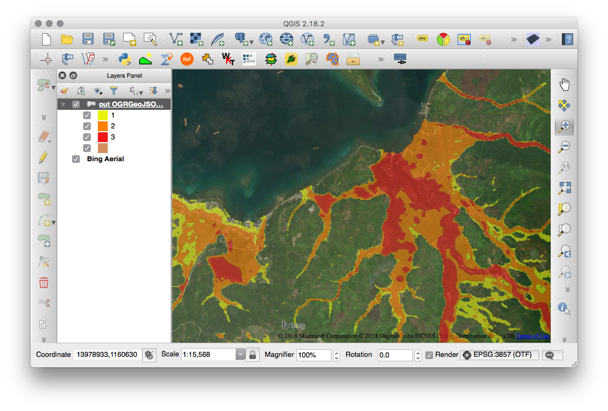

# Accessing the data via AWS CLI and GDAL/OGR commands

GDAL/OGR allows access to files stored on network, our datasets are hosted in S3 and you 
can query specific layers using GDAL's [Virtual File Systems](https://www.gdal.org/gdal_virtual_file_systems.html).  

This example, demonstrates how to access, query and extract the data using GDAL/OGR's command line interface. 

## Install tools

* Installing [AWS CLI](https://docs.aws.amazon.com/cli/latest/userguide/installing.html)
* Installing [GDAL/OGR](https://trac.osgeo.org/gdal/wiki/DownloadingGdalBinaries)

## List all objects from s3 bucket using AWS cli

```
aws s3 ls --no-sign-request s3://open-hazards-ph/ --recursive
```

```
2018-08-04 14:50:13          0 lipad/
2018-08-04 14:50:04          0 noah/
2018-08-25 11:19:01   32095489 noah/FLOOD/vector/YOLANDA_CORRIDOR/Aklan_Flood_100year.shp.geojson.zip
2018-08-25 11:26:33   64327559 noah/FLOOD/vector/YOLANDA_CORRIDOR/Antique_Flood_100year.shp.geojson.zip
2018-08-25 11:17:50   13234790 noah/FLOOD/vector/YOLANDA_CORRIDOR/Biliran_Flood_100year.shp.geojson.zip
2018-08-25 11:23:10   59895227 noah/FLOOD/vector/YOLANDA_CORRIDOR/Capiz_Flood_100year.shp.geojson.zip
2018-08-25 11:19:01  136727830 noah/FLOOD/vector/YOLANDA_CORRIDOR/Cebu_Flood_100year.shp.geojson.zip
2018-08-25 11:33:28    3901450 noah/FLOOD/vector/YOLANDA_CORRIDOR/DinagatIslands_Flood_100year.shp.geojson.zip
2018-08-25 11:17:35  108065324 noah/FLOOD/vector/YOLANDA_CORRIDOR/EasternSamar_Flood_100year.shp.geojson.zip
...

```

### Get metadata via GDAL/OGR

```
ogrinfo -so -al -ro /vsizip/vsicurl/https://s3.amazonaws.com/open-hazards-ph/noah/FLOOD/vector/YOLANDA_CORRIDOR/DinagatIslands_Flood_100year.shp.geojson.zip
```

```
INFO: Open of `/vsizip/vsicurl/https://s3.amazonaws.com/open-hazards-ph/noah/FLOOD/vector/YOLANDA_CORRIDOR/DinagatIslands_Flood_100year.shp.geojson.zip'
      using driver `GeoJSON' successful.

Layer name: DinagatIslands_Flood_100year
Geometry: Multi Polygon
Feature Count: 3
Extent: (125.466801, 10.245873) - (125.678260, 10.469820)
Layer SRS WKT:
GEOGCS["WGS 84",
    DATUM["WGS_1984",
        SPHEROID["WGS 84",6378137,298.257223563,
            AUTHORITY["EPSG","7030"]],
        AUTHORITY["EPSG","6326"]],
    PRIMEM["Greenwich",0,
        AUTHORITY["EPSG","8901"]],
    UNIT["degree",0.0174532925199433,
        AUTHORITY["EPSG","9122"]],
    AUTHORITY["EPSG","4326"]]
Var: Real (0.0)
```

## Convert to another format (ESRI Shapefile)

```
ogr2ogr -f "ESRI Shapefile" output.shp /vsizip/vsicurl/https://s3.amazonaws.com/open-hazards-ph/noah/FLOOD/vector/YOLANDA_CORRIDOR/DinagatIslands_Flood_100year.shp.geojson.zip
```

## Clip to a smaller subset

```
ogr2ogr -f "GeoJSON" -clipsrc  125.57 10.34 125.61 10.39 out.geojson /vsizip/vsicurl/https://s3.amazonaws.com/open-hazards-ph/noah/FLOOD/vector/YOLANDA_CORRIDOR/DinagatIslands_Flood_100year.shp.geojson.zip 
```


